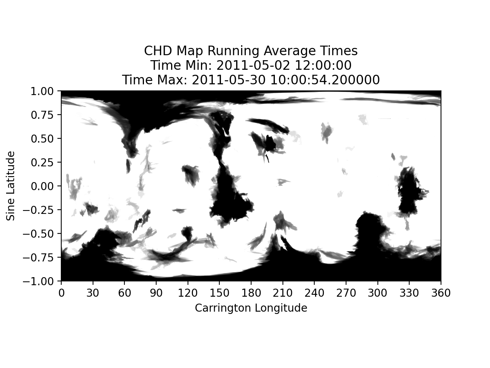
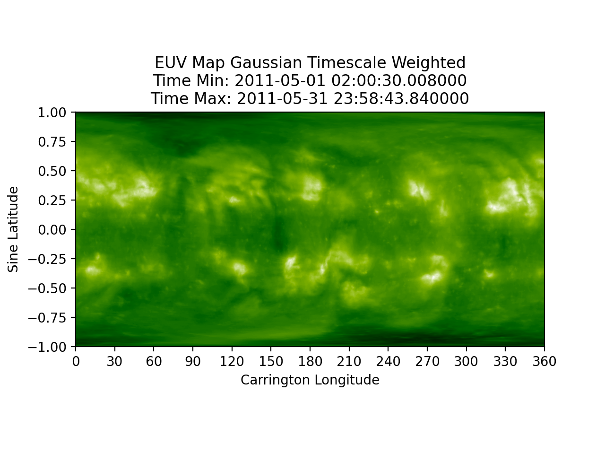

# Time-Varying Ensemble Detection
There are currently two methods of creating time-varying maps. 

The first creates maps of varying timescale based on user entered intervals around a 
specific user inputted center date. These [maps](#running-average-maps) are then combined with a weighted
average - either user inputted, or evenly weighted.  

The code for running average maps is found [here](https://github.com/predsci/CHD/blob/master/chmap/maps/time_averaged/running_average_maps.py).   


The second method uses a Gaussian distribution and a user inputted center date. 
The closer an image is to the center date, the more weight it has. Images are added
one at a time to create the resultant [maps](#gaussian-time-varying-maps).  
  
The code for gaussian time weighted maps is found [here](https://github.com/predsci/CHD/blob/master/chmap/maps/time_averaged/running_average_maps.py).   


## Running Average Maps
[EUV Map](../img/dp/time_wgt/EUV_Map_Timescale_Weighted_052011.png) | [CHD Map](../img/dp/time_wgt/CHD_Map_Timescale_Weighted_052011.png)
:-: | :-:
 | 

## Gaussian Time Varying Maps
[EUV Map](../img/dp/time_wgt/EUV_Gauss_Time_052011.png) | [CHD Map](../img/dp/time_wgt/CHD_Gauss_Time_052011.png)
:-: | :-:
 | 


## Code Outline

### Running Average Maps
This outline creates individual combined maps based on user defined 
timescales (1 day, 1 week, 2 weeks, etc.), then combines the maps based
on user defined weighting.  

```python
if timescale_weight is None:
    timescale_weight = [1.0 / len(timescales)] * len(timescales)
weight_sum = sum(timescale_weight)
if weight_sum != 1:
    raise ValueError("The timescale weights do not sum to 1. Please reenter weights or change to None for even weighting of maps.")
lbc_combo_query, iit_combo_query = chd_funcs.get_inst_combos(db_session, inst_list, time_min=max_time_min, time_max=max_time_max)
query_pd = db_funcs.query_euv_images(db_session=db_session, time_min=query_time_min, time_max=query_time_max)
los_image, iit_image, methods_list, use_indices = cr_funcs.apply_ipp(db_session, hdf_data_dir, inst_list, row, methods_list, lbc_combo_query,
                                                                     iit_combo_query, n_intensity_bins=n_intensity_bins, R0=R0)
chd_image = cr_funcs.chd(db_session, inst_list, los_image, iit_image, use_indices, iit_combo_query, thresh1=thresh1, thresh2=thresh2, nc=nc, iters=iters)
euv_map, chd_map = cr_funcs.create_map(iit_image, chd_image, methods_list, row, map_x=map_x, map_y=map_y, R0=R0)
euv_timescale[time_ind], chd_timescale[time_ind], combined_method, chd_combined_method = cr_funcs.cr_map(euv_map, chd_map, euv_timescale[time_ind],
                                 chd_timescale[time_ind], image_info, map_info, mu_cutoff=mu_cutoff, mu_merge_cutoff=mu_merge_cutoff)
euv_combined, chd_combined, timescale_method = dp_funcs.create_timescale_maps(euv_timescale, chd_timescale, timescale_weight, image_info_timescale, map_info_timescale)
dp_funcs.save_timescale_maps(db_session, map_data_dir, euv_combined, chd_combined, image_info_timescale, map_info_timescale, methods_list, combined_method, chd_combined_method, timescale_method)
```

* 1.) <code>timescale_weight = [1.0 / len(timescales)] * len(timescales)</code>  
    * if the timescale weights are undefined, create an array of even weights  
* 2.) <code>raise ValueError</code>  
    * check that the weights in the array add up to 1  
* 3.) <code>chd_funcs.get_inst_combos</code>
    * query the appropriate combo ids for each instrument based off the maximum time range the user inputted
* 4.) <code> db_funcs.query_euv_images</code>  
    * query the database for images based off the time range and center date
* 5.) <code>cr_funcs.apply_ipp</code>
    * apply image pre-processing corrections
* 6.) <code>cr_funcs.chd</code>
    * apply the Coronal Hole Detection algorithm to the image
* 7.) <code>cr_funcs.create_map</code>  
    * convert the image and detection to a map
* 8.) <code>cr_funcs.cr_map</code>
    * create combined maps using the method for synoptic mapping
* 9.) <code>dp_funcs.create_timescale_maps</code>
    * combine the timescale maps to create a running average map, based off the [timescale combination function](https://github.com/predsci/CHD/blob/master/chmap/maps/util/map_manip.py)
* 10.) <code>dp_funcs.save_timescale_maps</code>
    * plot and save timescale maps to the database, including the methods combination
    
### Gaussian Time Varying Maps
This method first creates a gaussian distribution and then weights images 
based off their closeness to a center date.  

```python
lbc_combo_query, iit_combo_query = chd_funcs.get_inst_combos(db_session, inst_list, time_min=query_time_min, time_max=query_time_max)
query_pd = db_funcs.query_euv_images(db_session=db_session, time_min=query_time_min, time_max=query_time_max)
norm_dist = dp_funcs.gauss_time(query_pd, sigma)
los_image, iit_image, methods_list, use_indices = cr_funcs.apply_ipp(db_session, hdf_data_dir, inst_list, row, methods_list, lbc_combo_query, iit_combo_query, n_intensity_bins=n_intensity_bins, R0=R0)
chd_image = cr_funcs.chd(db_session, inst_list, los_image, iit_image, use_indices, iit_combo_query, thresh1=thresh1, thresh2=thresh2, nc=nc, iters=iters)
euv_map, chd_map = cr_funcs.create_map(iit_image, chd_image, methods_list, row, map_x=map_x, map_y=map_y, R0=R0)
euv_combined, chd_combined, sum_wgt, combined_method = dp_funcs.time_wgt_map(euv_map, chd_map, euv_combined, chd_combined, image_info, weight, sum_wgt, sigma, mu_cutoff)
dp_funcs.save_gauss_time_maps(db_session, map_data_dir, euv_combined, chd_combined, image_info, map_info, methods_list, combined_method)
```

* 1.) <code>chd_funcs.get_inst_combos</code>
    * query the appropriate combo ids for each instrument based off the maximum time range the user inputted
* 2.) <code>db_funcs.query_euv_images</code>
    * query the database for images based off the time range and center date
* 3.) <code>dp_funcs.gauss_time</code>
    * generate a gaussian distribution based off the number of images queried and user defined sigma balue
* 4.) <code>cr_funcs.apply_ipp</code>
    * apply image pre-processing corrections
* 5.) <code>cr_funcs.chd</code>
    * apply the Coronal Hole Detection algorithm to the image
* 6.) <code>cr_funcs.create_map</code>  
    * convert the image and detection to a map
* 6.) <code>dp_funcs.time_wgt_map</code>
    * create combined maps based off the weighting of the Gaussian distribution
* 7.) <code>dp_funcs.save_gauss_time_maps</code>
    * plot and save time weighted maps to the database, including the methods combination