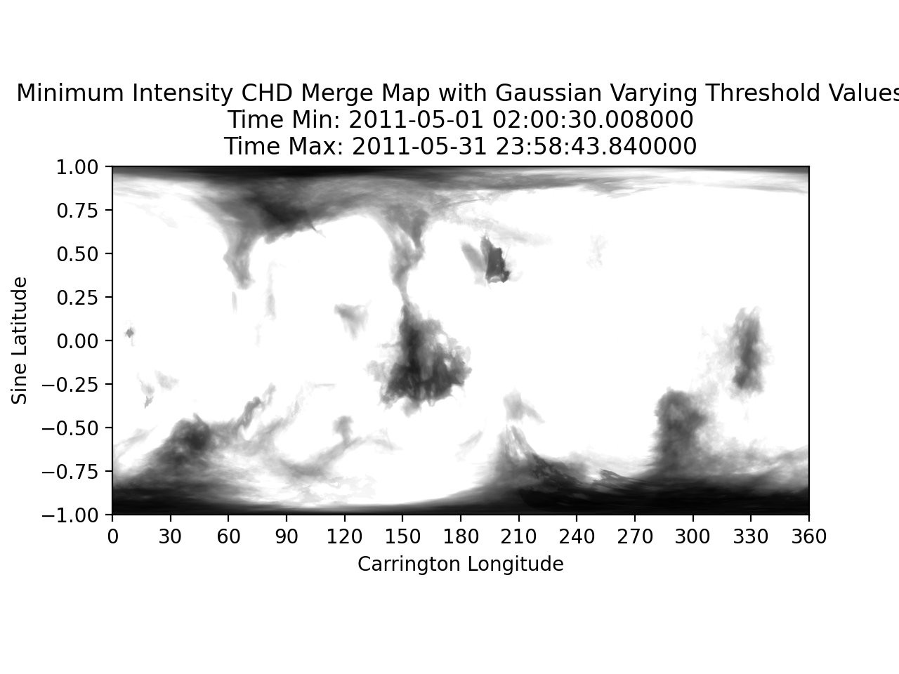

# Gaussian Varying Threshold Parameters

These maps are created using varying CHD Threshold parameters. The threshold
is varied based off a Gaussian distribution with a user inputted value of sigma (sigma=0.15) and thresholds for each image are randomly
selected. The only different data product produced here is the Coronal Hole Detection map, the
EUV map is the same as the [synoptic EUV maps](cr.md#cr-euv-map) created.

In these Gaussian weighted CHD Maps, coronal hole detections are weighted to produce
a probability type map just as in the [synoptic CHD Maps](cr.md#cr-chd-map).


## Example Maps
###[EUV Map](../img/dp/var_thresh/EUV_Map_052011.png)


###[CHD Map](../img/dp/var_thresh/Varying_Threshold_CHD_Map_052011.png)
  

## Code Outline

```python
query_pd = db_funcs.query_euv_images(db_session=db_session, time_min=query_time_min, time_max=query_time_max)
lbc_combo_query, iit_combo_query = chd_funcs.get_inst_combos(db_session, inst_list, time_min=query_time_min, time_max=query_time_max)
los_image, iit_image, methods_list, use_indices = cr_funcs.apply_ipp(db_session, hdf_data_dir, inst_list, row, methods_list, lbc_combo_query, iit_combo_query, n_intensity_bins=n_intensity_bins, R0=R0)
chd_image = dp_funcs.gauss_chd(db_session, inst_list, los_image, iit_image, use_indices, iit_combo_query, thresh1=thresh1, thresh2=thresh2, nc=nc, iters=iters, sigma=sigma)
euv_map, chd_map = cr_funcs.create_map(iit_image, chd_image, methods_list, row, map_x=map_x, map_y=map_y, R0=R0)
euv_combined, chd_combined, euv_combined_method, chd_combined_method = cr_funcs.cr_map(euv_map, chd_map, euv_combined, chd_combined, image_info, map_info, mu_cutoff=mu_cutoff, mu_merge_cutoff=mu_merge_cutoff)
dp_funcs.save_threshold_maps(db_session, map_data_dir, euv_combined, chd_combined, image_info, map_info, methods_list, euv_combined_method, chd_combined_method, sigma)
```

* 1.) <code>db_funcs.query_euv_images</code>
    * query the database for images based off the time range and center date
* 2.) <code>chd_funcs.get_inst_combos</code>
    * query the appropriate combo ids for each instrument based off the maximum time range the user inputted
* 3.) <code>cr_funcs.apply_ipp</code>
    * apply image pre-processing corrections
* 4.) <code>dp_funcs.gauss_chd</code>
    * apply Coronal Hole Detection algorithm based on gaussian weighted threshold parameters
* 5.) <code>cr_funcs.create_map</code>
    * convert the image and detection to a map
* 6.) <code>cr_funcs.cr_map</code>
    * add image to synoptic map 
* 7.) <code>dp_funcs.save_threshold_maps</code>
    * plot and save varying threshold map to database with included methods