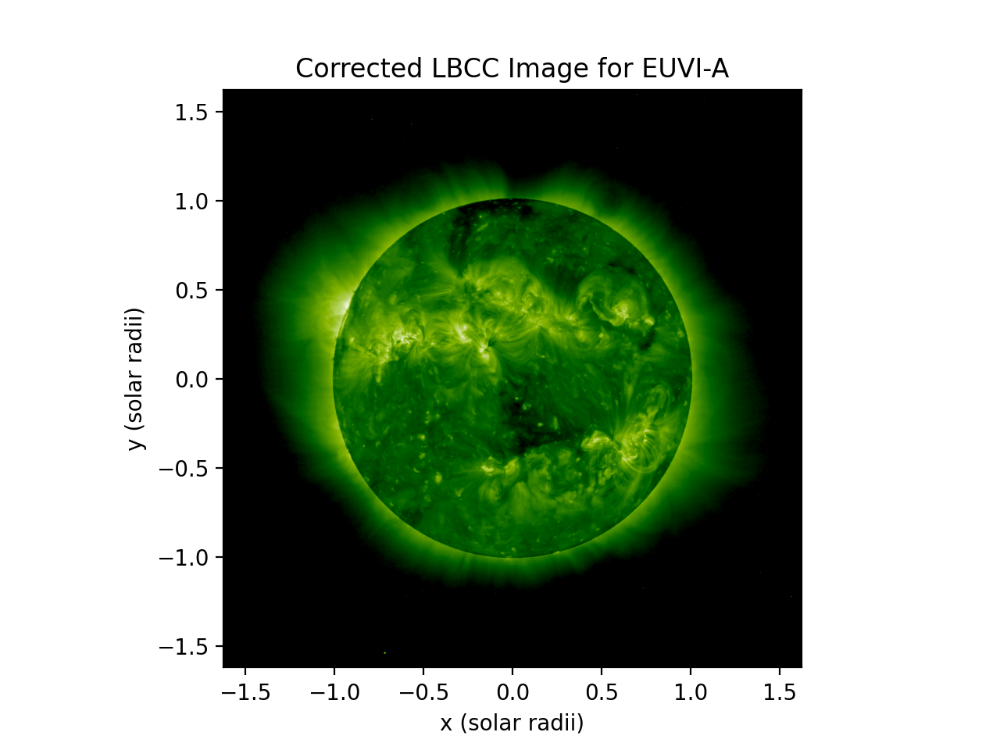
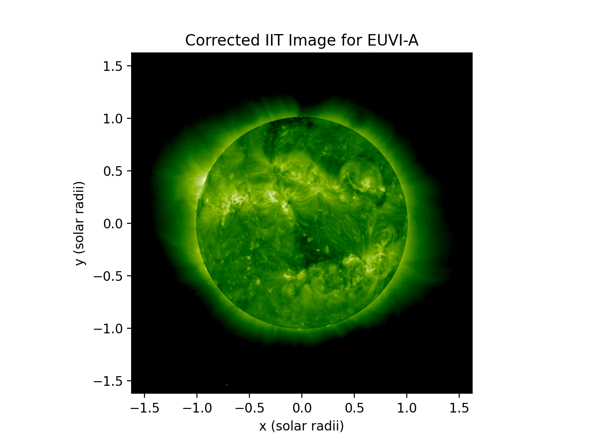
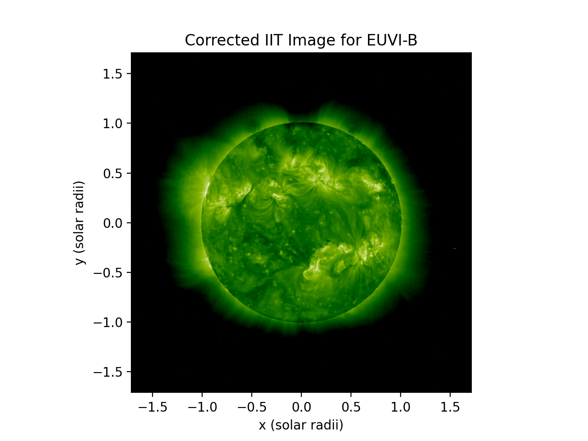
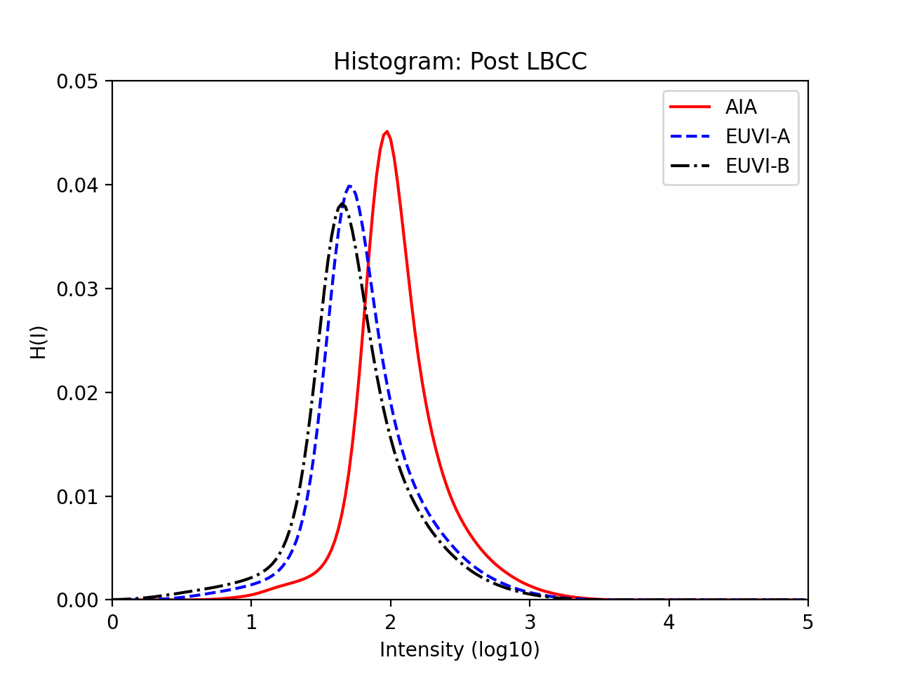
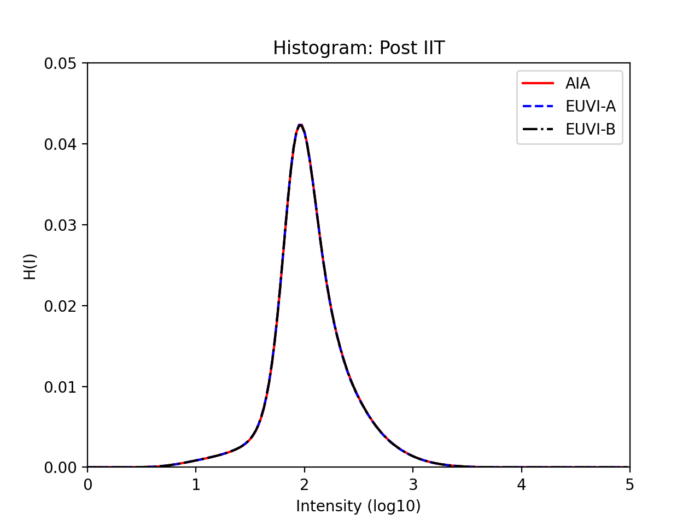

# Inter-Instrument Transformation
The goal of the inter-instrument correction is to equate the intensities from one instrument to the intensities of another.
The choice of which instrument to use as the "reference instrument" is an updatable parameter. 

## Examples of Corrected Images
These images of before and after applying IIT are from the different instruments at Carrington Rotation 2108.59. These can
be enlarged by clicking image titles.
### AIA Images
[Original AIA Image](../img/iit/AIA_original.png) | [Corrected AIA Image](../img/iit/AIA_corrected.png) |  [Difference AIA Image](../img/iit/AIA_difference.png)
:-: | :-: | :-:
 |  |    

### EUVI-A Images
[Original STA Image](../img/iit/STA_original.png) | [Corrected STA Image](../img/iit/STA_corrected.png) |  [Difference STA Image](../img/iit/STA_difference.png)
:-: | :-: | :-:
 |   |   

### EUVI-B Images
[Original STB Image](../img/iit/STB_original.png) | [Corrected STB Image](../img/iit/STB_corrected.png) |  [Difference STB Image](../img/iit/STB_difference.png)  
:-: | :-: | :-:
 |    |   

## Examples of Histograms
200 Intensity Bin Histograms before and after IIT Correction..
[LBC Corrected Histogram](../img/iit/hist_lbc_corrected.png)  | [IIT Corrected Histogram](../img/iit/hist_iit_corrected.png)
 :-: | :-:
  | 


## Analysis Pipeline

### Compute Histograms and Save to Database
This function applies the limb-brightening correction, calculates the associated IIT histogram, and saves these histograms to the database.  
The source code and example usage for this is found in the [CHD GitHub](https://github.com/predsci/CHD/blob/master/analysis/iit_analysis/IIT_create_hists.py)
and the generalized function can be found [here](https://github.com/predsci/CHD/blob/master/analysis/iit_analysis/IIT_pipeline_funcs.py).  

```python
def create_histograms(db_session, inst_list, lbc_query_time_min, lbc_query_time_max, hdf_data_dir, n_mu_bins=18,
                      n_intensity_bins=200, lat_band=[-np.pi / 64., np.pi / 64.], log10=True, R0=1.01):
    """ 
    function to apply LBC, create and save histograms to the database
    """
    image_pd = db_funcs.query_euv_images(db_session=db_session, time_min=lbc_query_time_min,
                                     time_max=lbc_query_time_max, instrument=query_instrument)
    combo_query = db_funcs.query_inst_combo(db_session, lbc_query_time_min, lbc_query_time_max,
                                      meth_name="LBCC Theoretic", instrument=instrument)
    original_los, lbcc_image, mu_indices, use_indices = lbcc_funcs.apply_lbc(db_session, hdf_data_dir, combo_query,
                                       image_row=row, n_intensity_bins=n_intensity_bins, R0=R0)
    hist = psi_d_types.LBCCImage.iit_hist(lbcc_image, lat_band, log10)
    iit_hist = psi_d_types.create_iit_hist(lbcc_image, method_id[1], lat_band, hist)
    db_funcs.add_hist(db_session, iit_hist) 

```     


* 1.) <code>db_funcs.query_euv_images</code>  
    * queries database for images (from EUV_Images table) in specified date range  
* 2.) <code>db_funcs.query_inst_combo</code>
    * queries database for closest image combinations to date observed 
* 3.) <code>lbcc_funcs.apply_lbc</code>  
    * applies Limb-Brightening Correction to images and creates LBCCImage datatype    
* 4.) <code>psi_d_types.LBCCImage.iit_hist</code>  
    * calculates IIT histogram from LBC corrected data  
* 5.) <code>psi_d_types.create_iit_hist</code>  
    * creates IIT histogram datatype                                 
* 6.) <code>db_funcs.add_hist</code>  
    * saves histograms to database (table Histogram) associating an image_id, meth_id, and basic information with histogram                               


### Calculate and Save Correction Coefficients
This function queries the database for IIT histograms, calculates correction coefficients, and saves them to the database.  
The source code and example usage for this is found in the [CHD GitHub](https://github.com/predsci/CHD/blob/master/analysis/iit_analysis/IIT_calc_coefficients.py)
and the generalized function can be found [here](https://github.com/predsci/CHD/blob/master/analysis/iit_analysis/IIT_pipeline_funcs.py).  

```python
def calc_iit_coefficients(db_session, inst_list, ref_inst, calc_query_time_min, calc_query_time_max, weekday=0, number_of_days=180,
                          n_intensity_bins=200, lat_band=[-np.pi / 2.4, np.pi / 2.4], create=False):
      """
      function to query IIT histograms, calculate IIT coefficients, and save to database
      """
      euv_images = db_funcs.query_euv_images(db_session, time_min=calc_query_time_min, time_max=calc_query_time_max,
                                   instrument=ref_instrument)
      ref_hist_pd = db_funcs.query_hist(db_session=db_session, meth_id=method_id[1], n_intensity_bins=n_intensity_bins,
                              lat_band=np.array(lat_band).tobytes(), time_min=calc_query_time_min - datetime.timedelta(days=number_of_days),
                              time_max=calc_query_time_max + datetime.timedelta(days=number_of_days), instrument=ref_instrument)
      rot_images = db_funcs.query_euv_images_rot(db_session, rot_min=rot_min, rot_max=rot_max,
                                               instrument=query_instrument)
      alpha_x_parameters = iit.optim_iit_linear(norm_hist_ref, norm_hist_fit, intensity_bin_edges, init_pars=init_pars)
      db_funcs.store_iit_values(db_session, pd_hist, meth_name, meth_desc, alpha_x_parameters.x, create)

```
                      
* 1.) <code>db_funcs.query_euv_images</code>
    * queries database for euv images for the reference instrument
    * used to get a range of Carrington rotation for which to calculate fit coefficients
* 2.) <code>db_funcs.query_hist</code>
    * queries database for histograms (from Histogram table) in specified date range  
* 3.) <code>db_funcs.query_euv_images_rot</code>
    * queries database for euv images by Carrington rotation range
* 4.) <code>iit.optim_iit_linear</code>
    * use linear optimization method to calculate fit parameters
    * hist_ref and hist_fit are the reference histogram and the instrument histogram for the fit
        * these are determined using boolean indexing
* 5.) <code>db_funcs.store_iit_values</code>
    * save the two fit coefficients to database using function [store_iit_values](https://github.com/predsci/CHD/blob/master/modules/DB_funs.py)
        * creates image combination combo_id of image_ids and dates in Images_Combos table
        * creates association between each image_id and combo_id in Image_Combo_Assoc table
        * creates new method “IIT” with an associated meth_id in Meth_Defs table
        * creates new variable definitions "alpha and "x"" with an associated var_id in Var_Defs table
        * store variable value as float in Var_Vals table with associated combo_id, meth_id, and var_id  
 
    


### Apply Inter-Instrument Transformation and Plot New Images
This function queries the database for IIT coefficients, applies the correction, and plots resulting images.  
The source code and example usage for this is found in the [CHD GitHub](https://github.com/predsci/CHD/blob/master/analysis/iit_analysis/IIT_apply_correction.py)
and the generalized function can be found [here](https://github.com/predsci/CHD/blob/master/analysis/iit_analysis/IIT_pipeline_funcs.py).

```python
def apply_iit_correction(db_session, hdf_data_dir, iit_query_time_min, iit_query_time_max, inst_list, 
                 n_mu_bins, n_intensity_bins, n_images_plot=1, plot=False):
    """
    function to query IIT correction coefficients, apply correction, and plot resulting images
    """
    euv_images = db_funcs.query_euv_images(db_session, time_min=iit_query_time_min, time_max=iit_query_time_max,
                                   instrument=ref_instrument)
    rot_images = db_funcs.query_euv_images_rot(db_session, rot_min=rot_min, rot_max=rot_max,
                                           instrument=query_instrument)
    combo_query_lbc = db_funcs.query_inst_combo(db_session, iit_query_time_min, iit_query_time_max, lbc_meth_name,
                                                instrument)
    combo_query_iit = db_funcs.query_inst_combo(db_session, iit_query_time_min, iit_query_time_max, iit_meth_name,
                                                instrument)
    original_los, lbcc_image, mu_indices, use_indices = lbcc_funcs.apply_lbc(db_session, hdf_data_dir, combo_query_lbc,
                                                image_row=row, n_intensity_bins=n_intensity_bins, R0=R0)
    lbcc_image, iit_image, use_indices = apply_iit(db_session, hdf_data_dir, combo_query_iit, lbcc_image, use_indices, image_row=row, R0=R0)            
    if plot:
        Plotting.PlotCorrectedImage(lbcc_data, los_image=original_los, nfig=100 + inst_index * 10 + index,
                            title="Corrected LBCC Image for " + instrument)
        Plotting.PlotCorrectedImage(corrected_iit_data, los_image=original_los,
                            nfig=200 + inst_index * 10 + index, title="Corrected IIT Image for " + instrument)
        Plotting.PlotCorrectedImage(lbcc_data - corrected_iit_data, los_image=original_los,
                            nfig=300 + inst_index * 10 + index, title="Difference Plot for " + instrument)
```
        

* 1.) <code>db_funcs.query_euv_images</code>
    * queries database for images (from EUV_Images table) in specified date range  
    * queries for reference instrument to get minimum and maximum Carrington rotation
* 2.) <code>db_funcs.query_euv_images_rot</code>
    * queries for instrument in question based on Carrington rotation range
* 3.) <code>db_funcs.query_inst_combo</code>
    * queries database for closest image combinations to date observed 
    * does this for both the LBC and IIT methods
* 4.) <code>lbcc_funcs.apply_lbc</code>  
    * applies Limb-Brightening Correction to images and creates LBCCImage datatype  
* 5.) <code>apply_iit</code>  
    * applies Inter-Instrument Transformation Correction to images and creates IITImage datatype 
* 6.) <code>Plotting.PlotCorrectedImage</code>
    * plots LBC images, IIT corrected images, and the difference between them                                
           
                                         
#### Apply IIT ####
This is a sub-step that applies the Inter-Instrument Transformation Correction to individual image and returns the correct IIT Image. 
It is called during the [third step](../ipp/iit.md#apply-inter-instrument-transformation-and-plot-new-images) of Inter-Instrument Transformation.

```python
def apply_iit(db_session, hdf_data_dir, inst_combo_query, lbcc_image, image_row, R0=1.01):
    """
    function to apply IIT to a specific image, returns corrected image
    """
    method_id_info = db_funcs.get_method_id(db_session, meth_name, meth_desc=None, var_names=None,
                                            var_descs=None, create=False)

    alpha_x_parameters = db_funcs.query_var_val(db_session, meth_name, date_obs=lbcc_image.date_obs,
                                                inst_combo_query=inst_combo_query)
    corrected_iit_data[use_indices] = 10 ** (alpha * np.log10(lbcc_data[use_indices]) + x)
    iit_image = psi_d_types.create_iit_image(lbcc_image, corrected_iit_data, method_id_info[1], hdf_path)

    return lbcc_image, iit_image, use_indices  
```
                                              
 
* 1.) <code>db_funcs.get_method_id</code>
    * queries database for method id associated with method name                                                                                         
* 2.) <code>db_funcs.query_var_val</code>
    * queries database for variable values associated with specific image (from Var_Vals table)
* 3.) <code>corrected_iit_data[use_indices] = 10 ** (alpha * np.log10(lbcc_data[use_indices]) + x)</code>
    * applies correction to image based off alpha, x, and lbcc corrected data arrays
* 4.) <code>psi_d_types.create_iit_image</code>
    * create IIT Image datatype from corrected IIT data
                                                                        
                                                                             


### Generate Histogram Plots
This function generates histogram plots comparing data from before and after the IIT correction.  
The source code and example usage for this is found in the [CHD GitHub](https://github.com/predsci/CHD/blob/master/analysis/iit_analysis/IIT_plot_hists.py)
and the generalized function can be found [here](https://github.com/predsci/CHD/blob/master/analysis/iit_analysis/IIT_pipeline_funcs.py).  

```python
def plot_iit_histograms(db_session, hdf_data_dir, hist_query_time_min, hist_query_time_max, inst_list, ref_inst,
                                n_intensity_bins=200, lat_band=[-np.pi / 2.4, np.pi / 2.4], R0=1.01, log10=True):
        
    """
    function to create corrected IIT histograms then plot original, LBC Corrected, and IIT Corrected histograms for comparison
    """
    pd_hist = db_funcs.query_hist(db_session=db_session, meth_id=method_id[1], n_intensity_bins=n_intensity_bins,
                              lat_band=np.array(lat_band).tobytes(), time_min=hist_query_time_min, time_max=hist_query_time_max)               
    combo_query_lbc = db_funcs.query_inst_combo(db_session, hist_query_time_min, hist_query_time_max, meth_name="LBCC Theoretic", instrument=instrument)
    combo_query_iit = db_funcs.query_inst_combo(db_session, hist_query_time_min, hist_query_time_max, meth_name="IIT", instrument=instrument)
    image_pd = db_funcs.query_euv_images(db_session=db_session, time_min=hist_query_time_min,
                              time_max=hist_query_time_max, instrument=query_instrument)
    original_los, lbcc_image, mu_indices, use_indices = lbcc_funcs.apply_lbc(db_session, hdf_data_dir, combo_query_lbc,
                              image_row=row, n_intensity_bins=n_intensity_bins, R0=R0)
    original_los_hist = psi_d_types.LosImage.iit_hist(original_los, intensity_bin_edges, lat_band, log10)
    lbcc_image, iit_image, use_indices = apply_iit(db_session, hdf_data_dir, combo_query_iit, lbcc_image, use_indices, image_row=row, R0=R0)
    hist_iit = psi_d_types.IITImage.iit_hist(iit_image, lat_band, log10)
    Plotting.Plot1d_Hist(norm_original_hist, instrument, inst_index, intensity_bin_edges, color_list,
                     linestyle_list, figure=100, xlabel="Intensity (log10)", ylabel="H(I)", title="Histogram: Original Image")
    Plotting.Plot1d_Hist(norm_lbc_hist, instrument, inst_index, intensity_bin_edges, color_list, linestyle_list,
             figure=200, xlabel="Intensity (log10)", ylabel="H(I)", title="Histogram: Post LBCC")
    Plotting.Plot1d_Hist(norm_corrected_hist, instrument, inst_index, intensity_bin_edges, color_list, linestyle_list,
             figure=300, xlabel="Intensity (log10)", ylabel="H(I)", title="Histogram: Post IIT")
```
        
                  
                     
* 1.) <code>db_funcs.query_hist</code>
    * queries database for histograms (from Histogram table) in specified date range                     
* 2.) <code>db_funcs.query_euv_images</code>
    * queries database for images (from EUV_Images table) in specified date range 
* 3.) <code>db_funcs.query_inst_combo</code>
    * queries database for closest image combinations to date observed 
    * does this for both the LBC and IIT methods
* 3.) <code>lbcc_funcs.apply_lbc</code>  
    * applies Limb-Brightening Correction to images and creates LBCCImage datatype 
* 4.) <code>psi_d_types.LosImage.iit_hist</code>
    * create 1D IIT Histogram from original LOS image data
* 5.) <code>apply_iit</code>  
    * applies Inter-Instrument Transformation Correction to images and creates IITImage datatype 
* 6.) <code>psi_d_types.IITImage.iit_hist</code>
    * create 1D IIT Histogram from corrected IIT image data   
* 7.) <code>Plotting.Plot1d_Hist</code>
    * plot 1D Normalized IIT Histograms for original, LBC, and IIT data