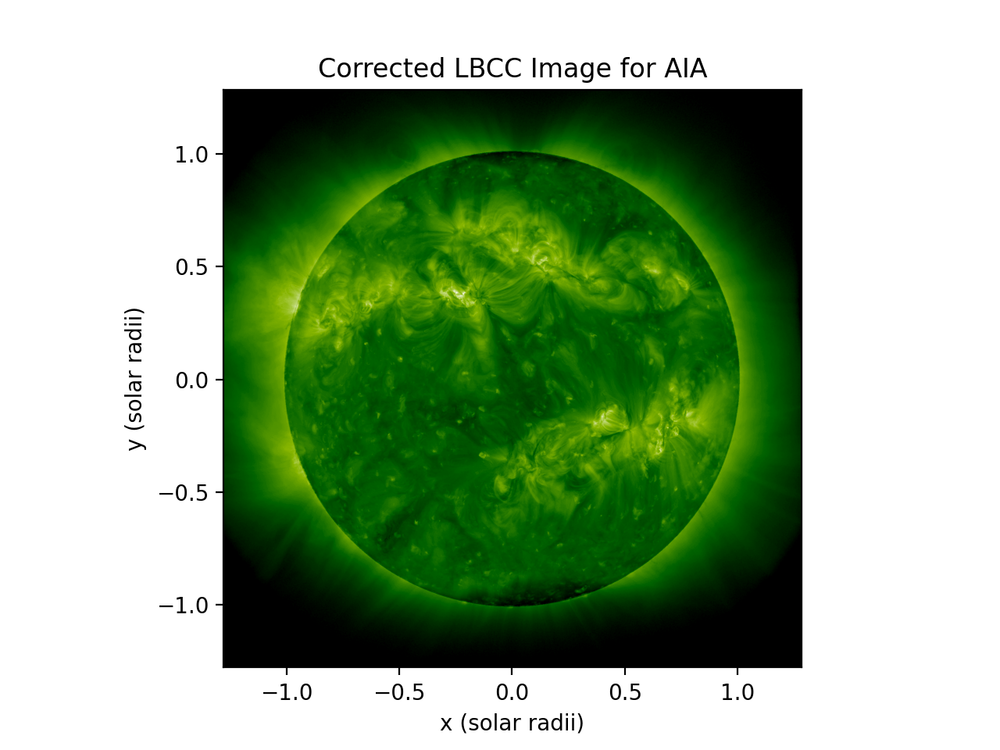
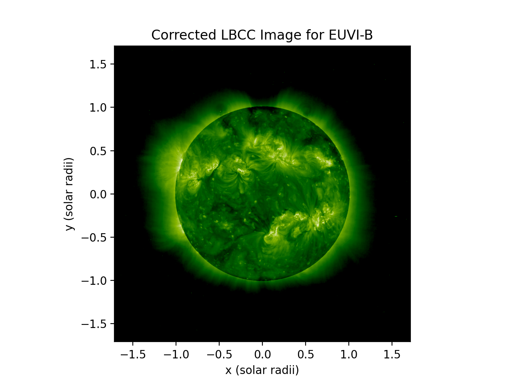
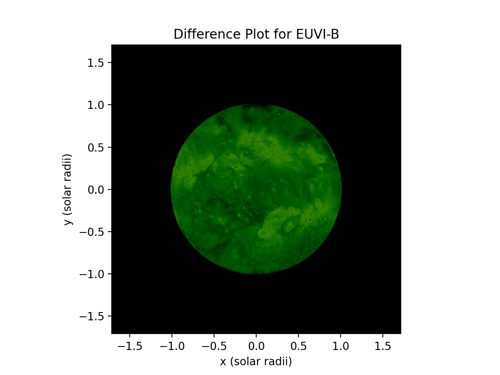
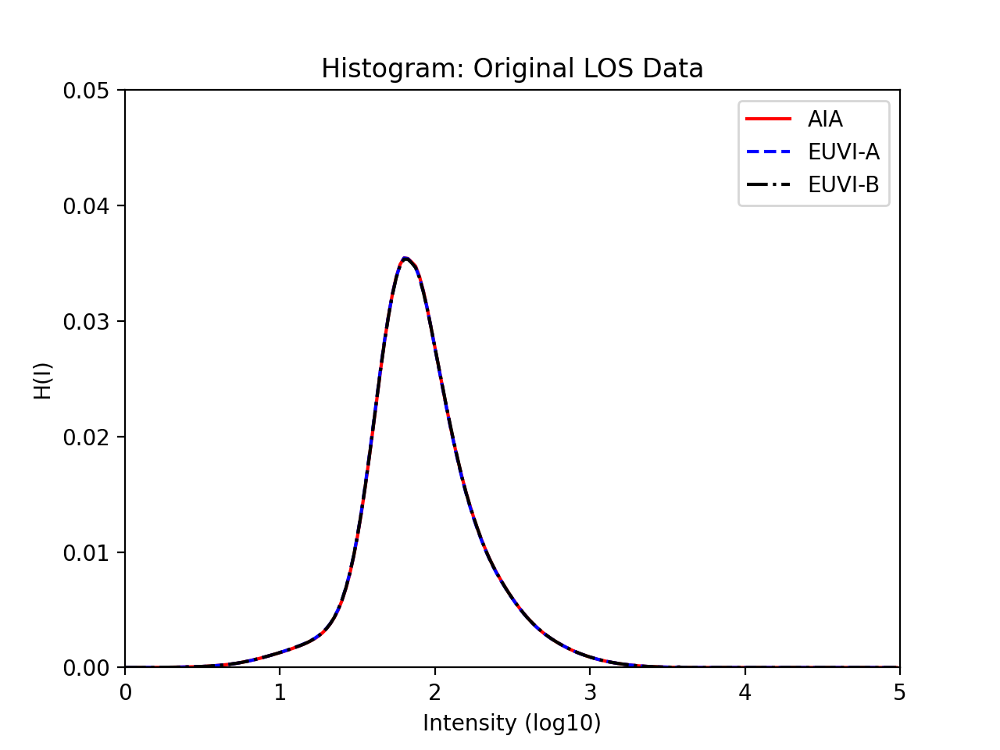

# Inter-Instrument Transformation
The goal of the inter-instrument correction is to equate the intensities from one instrument to the intensities of another.
The choice of which instrument to use as the "reference instrument" is an updatable parameter. 

## Examples of Corrected Images
### AIA Images
[Original AIA Image](../img/iit/AIA_original.png) | [Corrected AIA Image](../img/iit/AIA_corrected.png) |  [Difference AIA Image](../img/iit/AIA_difference.png)
- | - | -
 |  |    

### EUVI-A Images
[Original STA Image](../img/iit/STA_original.png) | [Corrected STA Image](../img/iit/STA_corrected.png) |  [Difference STA Image](../img/iit/STA_difference.png)
- | - | -
 |   |   

### EUVI-B Images
[Original STB Image](../img/iit/STB_original.png) | [Corrected STB Image](../img/iit/STB_corrected.png) |  [Difference STB Image](../img/iit/STB_difference.png)  
- | - | -
 |    |   

## Examples of Histograms
[Original Histogram](../img/iit/hist_original.png) | [Corrected Histogram](../img/iit/hist_corrected.png)  
- | - 
 |   

## Analysis Pipeline

### Compute Histograms and Save to Database
This function applies the limb-brightening correction, calculates the associated IIT histogram, and saves these histograms to the database.  
The source code and example usage for this is found in the [CHD GitHub](https://github.com/predsci/CHD/blob/master/analysis/iit_analysis/IIT_create_hists.py)
and the generalized function can be found [here](https://github.com/predsci/CHD/blob/master/analysis/iit_analysis/IIT_pipeline_funcs.py).  

        def create_histograms(db_session, inst_list, lbc_query_time_min, lbc_query_time_max, hdf_data_dir, n_mu_bins=18,
                      n_intensity_bins=200, lat_band=[-np.pi / 64., np.pi / 64.],
                      log10=True, R0=1.01):
            """ 
            function to apply LBC, create and save histograms to the database
            """
            image_pd = db_funcs.query_euv_images(db_session=db_session, time_min=lbc_query_time_min,
                                             time_max=lbc_query_time_max, instrument=query_instrument)
            original_los, lbcc_image, mu_indices, use_indices = apply_lbc_correction(db_session, hdf_data_dir, instrument,
                                             image_row=row, n_intensity_bins=n_intensity_bins, R0=R0)
            hist = psi_d_types.LBCCImage.iit_hist(lbcc_image, lat_band, log10)
            iit_hist = psi_d_types.create_iit_hist(lbcc_image, method_id[1], lat_band, hist)
            db_funcs.add_hist(db_session, iit_hist)      

* 1.)  <code>db_funcs.query_euv_images</code>  
    * queries database for images (from EUV_Images table) in specified date range  
* 2.)  <code>apply_lbc_correction</code>  
    * applies Limb-Brightening Correction to images and creates LBCCImage datatype    
* 3.)   <code>psi_d_types.LBCCImage.iit_hist</code>  
    * calculates IIT histogram from LBC corrected data  
* 4.)  <code>psi_d_types.create_iit_hist</code>  
    * creates IIT histogram datatype                                 
* 5.)  <code>db_funcs.add_hist</code>  
    * saves histograms to database (table Histogram) associating an image_id, meth_id, and basic information with histogram                               

### Calculate and Save Correction Coefficients
This function queries the database for IIT histograms, calculates correction coefficients, and saves them to the database.  
The source code and example usage for this is found in the [CHD GitHub](https://github.com/predsci/CHD/blob/master/analysis/iit_analysis/IIT_calc_coefficients.py)
and the generalized function can be found [here](https://github.com/predsci/CHD/blob/master/analysis/iit_analysis/IIT_pipeline_funcs.py).  

        def calc_iit_coefficients(db_session, inst_list, ref_inst, calc_query_time_min, calc_query_time_max, weekday=0, number_of_days=180,
                          n_intensity_bins=200, lat_band=[-np.pi / 2.4, np.pi / 2.4], create=False):
              """
              function to query IIT histograms, calculate IIT coefficients, and save to database
              """
              pd_hist = db_funcs.query_hist(db_session=db_session, meth_id=method_id[1], n_intensity_bins=n_intensity_bins,
                              lat_band=np.array(lat_band).tobytes(),
                              time_min=np.datetime64(min_date).astype(datetime.datetime),
                              time_max=np.datetime64(max_date).astype(datetime.datetime),
                              instrument=query_instrument)
              alpha_x_parameters = iit.optim_iit_linear(hist_ref, hist_fit, intensity_bin_edges,
                                      init_pars=init_pars)
              db_funcs.store_iit_values(db_session, pd_hist, meth_name, meth_desc, alpha_x_parameters.x, create)
                      
* 1.) <code>db_funcs.query_hist</code>
    * queries database for histograms (from Histogram table) in specified date range  
* 2.) <code>iit.optim_iit_linear</code>
    * use linear optimization method to calculate fit parameters
* 3.) <code>db_funcs.store_iit_values</code>
    * save the two fit coefficients to database using function [store_iit_values](https://github.com/predsci/CHD/blob/master/modules/DB_funs.py)
        * creates image combination combo_id of image_ids and dates in Images_Combos table
        * creates association between each image_id and combo_id in Image_Combo_Assoc table
        * creates new method “IIT” with an associated meth_id in Meth_Defs table
        * creates new variable definitions "alpha and "x"" with an associated var_id in Var_Defs table
        * store variable value as float in Var_Vals table with associated combo_id, meth_id, and var_id  
       
    
### Apply Inter-Instrument Transformation and Plot New Images
This function queries the database for IIT coefficients, applies the correction, and plots resulting images.  
The source code and example usage for this is found in the [CHD GitHub](https://github.com/predsci/CHD/blob/master/analysis/iit_analysis/IIT_apply_correction.py)
and the generalized function can be found [here](https://github.com/predsci/CHD/blob/master/analysis/iit_analysis/IIT_pipeline_funcs.py).  

        def apply_iit_correction(db_session, hdf_data_dir, iit_query_time_min, iit_query_time_max, inst_list, 
                         n_mu_bins, n_intensity_bins, plot=False):
            """
            function to query IIT correction coefficients, apply correction, and plot resulting images
            """
            image_pd = db_funcs.query_euv_images(db_session=db_session, time_min=iit_query_time_min,
                                 time_max=iit_query_time_max, instrument=query_instrument)
            original_los, lbcc_image, mu_indices, use_indices = apply_lbc_correction(db_session, hdf_data_dir,
                                 instrument, image_row=row, n_intensity_bins=n_intensity_bins, R0=R0)                     
            alpha_x_parameters = db_funcs.query_var_val(db_session, meth_name, date_obs=lbcc_image.date_obs,
                                                instrument=instrument)                    
            corrected_iit_data[use_indices] = 10 ** (alpha * np.log10(lbcc_data[use_indices]) + x)                    
            if plot:
                Plotting.PlotCorrectedImage(lbcc_data, los_image=original_los, nfig=100 + inst_index * 10 + index,
                                    title="Corrected LBCC Image for " + instrument)
                Plotting.PlotCorrectedImage(corrected_iit_data, los_image=original_los,
                                    nfig=200 + inst_index * 10 + index, title="Corrected IIT Image for " + instrument)
                Plotting.PlotCorrectedImage(lbcc_data - corrected_iit_data, los_image=original_los,
                                    nfig=300 + inst_index * 10 + index, title="Difference Plot for " + instrument)

* 1.) <code>db_funcs.query_euv_images</code>
    * queries database for images (from EUV_Images table) in specified date range  
* 2.)  <code>apply_lbc_correction</code>  
    * applies Limb-Brightening Correction to images and creates LBCCImage datatype  
* 3.) <code>db_funcs.query_var_val</code>
    * queries database for variable values associated with specific image (from Var_Vals table)
* 4.) <code>corrected_iit_data[use_indices] = 10 ** (alpha * np.log10(lbcc_data[use_indices]) + x)</code>
    * applies correction to image based off alpha, x, and limb-brightening corrected data arrays 
* 5.) <code>Plotting.PlotCorrectedImage</code>
    * plots LBC images, IIT corrected images, and the difference between them                                
                                         
                                         
                                                                             
### Generate Histogram Plots
This function generates histogram plots comparing data from before and after the IIT correction.  
The source code and example usage for this is found in the [CHD GitHub](https://github.com/predsci/CHD/blob/master/analysis/iit_analysis/IIT_plot_hists.py)
and the generalized function can be found [here](https://github.com/predsci/CHD/blob/master/analysis/iit_analysis/IIT_pipeline_funcs.py).  

        def generate_iit_histograms(db_session, hist_query_time_min, hist_query_time_max, inst_list, ref_inst,
                            n_intensity_bins=200, lat_band=[-np.pi / 2.4, np.pi / 2.4]):
            """
            function to create corrected IIT histograms then plot original and corrected histograms for comparison
            """
            pd_hist = db_funcs.query_hist(db_session=db_session, meth_id=method_id[1], n_intensity_bins=n_intensity_bins,
                                    lat_band=np.array(lat_band).tobytes(), time_min=hist_query_time_min, time_max=hist_query_time_max)               
            image_pd = db_funcs.query_euv_images(db_session=db_session, time_min=hist_query_time_min,
                                    time_max=hist_query_time_max, instrument=query_instrument)
            original_los, lbcc_image, mu_indices, use_indices = iit_funcs.apply_lbc_correction(db_session, hdf_data_dir, instrument,
                                    image_row=row, n_intensity_bins=n_intensity_bins, R0=R0)
            alpha, x = db_funcs.query_var_val(db_session, meth_name, date_obs=lbcc_image.date_obs,
                                    instrument=instrument)
            corrected_iit_data[use_indices] = 10 ** (alpha * np.log10(lbcc_data[use_indices]) + x)
            Plotting.Plot_IIT_Hists(pd_hist, corrected_hist_list, full_hist, instrument, ref_inst, inst_index, ref_index,
                            intensity_bin_edges, color_list, linestyle_list)

* 1.) <code>db_funcs.query_hist</code>
    * queries database for histograms (from Histogram table) in specified date range                     
* 2.) <code>db_funcs.query_euv_images</code>
    * queries database for images (from EUV_Images table) in specified date range  
* 3.)  <code>apply_lbc_correction</code>  
    * applies Limb-Brightening Correction to images and creates LBCCImage datatype 
* 4.) <code>db_funcs.query_var_val</code>
    * queries database for variable values associated with specific image (from Var_Vals table)
* 5.) <code>corrected_iit_data[use_indices] = 10 ** (alpha * np.log10(lbcc_data[use_indices]) + x)</code>
    * applies correction to image based off alpha, x, and limb-brightening corrected data arrays  
* 6.) <code>Plotting.Plot_IIT_Hists</code>
    * plots original 1D histogram and corrected 1D IIT histogram  