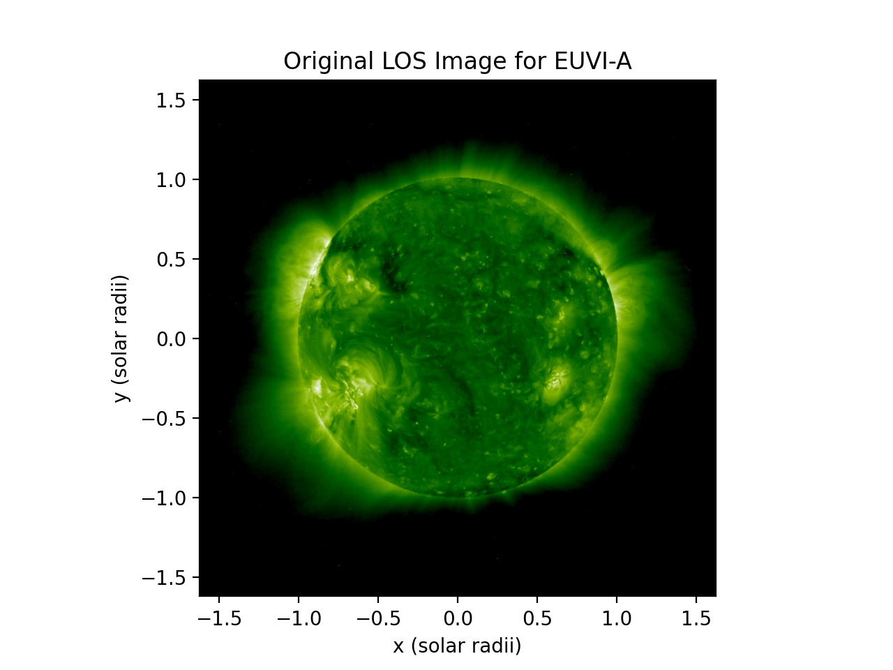

# Limb-Brightening Correction
Limb Brightening Correction (LBC) is the second step in the data pre-processing pipeline. 
The goal of LBC is to correct for brightening of structures that is 
dependent on their distance from disk center. This process uses a theoretic model.... 

## Examples of Corrected Images
### AIA Images
[Original AIA Image](../img/original_AIA.png) | [Corrected AIA Image](../img/corrected_AIA.png)
- | - 
 |   

### EUVI-A Images
[Original STA Image](../img/original_STA.png) | [Corrected STA Image](../img/corrected_STA.png)
- | - 
 |   

### EUVI-B Images
[Original STB Image](../img/original_STB.png) | [Corrected STB Image](../img/corrected_STB.png)
- | - 
 |     

## Theoretical Analysis Pipeline

### Compute Histograms 
The source code for this is found in the [CHD GitHub](https://github.com/predsci/CHD/blob/master/analysis/lbcc_analysis/LBCC_create_mu-hist.py) 
and the generalized function can be found [here](https://github.com/predsci/CHD/blob/master/analysis/lbcc_analysis/LBCC_theoretic_funcs.py).  

    def save_histograms(db_session, hdf_data_dir, inst_list, hist_query_time_min, hist_query_time_max, n_mu_bins=18,
                        n_intensity_bins=200, lat_band=[-np.pi / 64., np.pi / 64.], log10=True, R0=1.01):
            """
            function to create and save histograms to database
            """
            query_pd = db_funcs.query_euv_images(db_session=db_session, time_min=hist_query_time_min,
                                                 time_max=hist_query_time_max, instrument=query_instrument)
            temp_hist = los_temp.mu_hist(image_intensity_bin_edges, mu_bin_edges, lat_band=lat_band, log10=log10)
            hist_lbcc = psi_d_types.create_hist(hdf_path, row.image_id, mu_bin_edges, image_intensity_bin_edges,
                                                lat_band, temp_hist)
            db_funcs.add_lbcc_hist(hist_lbcc, db_session)
    
 
* 1.)  <code>db_funcs.query_euv_images</code>  
    * queries database for images (from EUV_Images table) in specified date range  
* 2.)  <code>los_temp.mu_hist</code>  
    * creates histogram based on number of mu and intensity bins    
* 3.)   <code>psi_d_types.create_hist</code>  
    * converts histogram to lbcc_hist datatype  
* 4.)  <code>db_funcs.add_lbcc_hist</code>  
    * saves histograms to database (table LBCC_Hist) associating an image_id and basic information with histogram  

### Calculate and Save Theoretical Fit Parameters
The source code for this is found in the [CHD GitHub](https://github.com/predsci/CHD/blob/master/analysis/lbcc_analysis/LBCC_beta-y_theoretical_analysis.py) 
and the generalized function can be found [here](https://github.com/predsci/CHD/blob/master/analysis/lbcc_analysis/LBCC_theoretic_funcs.py). 

    def calc_theoretic_fit(db_session, inst_list, calc_query_time_min, number_of_weeks=27, number_of_days=180, n_mu_bins=18,
                       n_intensity_bins=200, lat_band=[-np.pi / 64., np.pi / 64.], create=False):
        """
        function to calculate and save (to database) theoretic LBC fit parameters
        """
        pd_hist = db_funcs.query_hist(db_session=db_session, n_mu_bins=n_mu_bins, n_intensity_bins=n_intensity_bins,
                                          lat_band=np.array(lat_band).tobytes(),
                                          time_min=np.datetime64(min_date).astype(datetime.datetime),
                                          time_max=np.datetime64(max_date).astype(datetime.datetime),
                                          instrument=query_instrument)
        optim_out_theo = optim.minimize(lbcc.get_functional_sse, init_pars,
                                            args=(hist_ref, hist_mat, mu_vec, intensity_bin_array, model),
                                            method="BFGS")  
        db_funcs.store_lbcc_values(db_session, pd_hist, meth_name, meth_desc, var_name, var_desc, date_index,
                                       inst_index, optim_vals=optim_vals_theo[0:6], results=results_theo, create=True)                                                                   
                                          
* 1.) <code>db_funcs.query_hist</code>
    * queries database for histograms (from LBCC_Hist table) in specified date range
* 2.) <code>optim.minimize</code>
    * use theoretical optimization method to calculate fit parameters
* 3.) <code>db_funcs.store_lbcc_values</code>
    * save the six fit parameters to database using function store_lbcc_values from modules/DB_funs
        * creates image combination combo_id of image_ids and dates in Images_Combos table
        * creates association between each image_id and combo_id in Image_Combo_Assoc table
        * creates new method “LBCC Theoretic” with an associated meth_id in Meth_Defs table
        * creates new variable definitions “TheoVar” + index with an associated var_id in Var_Defs table
        * store variable value as float in Var_Vals table with associated combo_id, meth_id, and var_id  
        
        

### Apply Limb-Brightening Correction and Plot Corrected Images
The source code for this is found in the [CHD GitHub](https://github.com/predsci/CHD/blob/master/analysis/lbcc_analysis/LBCC_apply_fit.py) 
and the generalized function can be found [here](https://github.com/predsci/CHD/blob/master/analysis/lbcc_analysis/LBCC_theoretic_funcs.py). 

    def apply_lbc_correction(db_session, hdf_data_dir, inst_list, lbc_query_time_min, lbc_query_time_max, n_mu_bins=18,
                         R0=1.01, plot=False):
        """
        function to apply limb-brightening correction and plot images within a certain time frame
        """ 
        image_pd = db_funcs.query_euv_images(db_session=db_session, time_min=lbc_query_time_min,
                                             time_max=lbc_query_time_max, instrument=query_instrument) 
        theoretic_query = db_funcs.query_var_val(db_session, meth_name, date_obs=original_los.info['date_string'],
                                                 instrument=instrument)
        beta, y = lbcc.get_beta_y_theoretic_interp(theoretic_query, mu_array_2d=original_los.mu,
                                                   mu_array_1d=mu_bin_centers)
        corrected_los_data = beta * original_los.data + y
        db_funcs.add_corrected_image(db_session, corrected_image=lbcc_data)
        if plot:
            Plotting.PlotImage(original_los, nfig=100 + inst_index, title="Original LOS Image for " + instrument)
            Plotting.PlotLBCCImage(lbcc_data=corrected_los_data, los_image=original_los, nfig=200 + inst_index,
                                   title="Corrected LBCC Image for " + instrument)
            Plotting.PlotLBCCImage(lbcc_data=original_los.data - corrected_los_data, los_image=original_los,
                                   nfig=300 + inst_index, title="Difference Plot for " + instrument)
                                                              
* 1.) <code>db_funcs.query_euv_images</code>
    * queries database for images (from EUV_Images table) in specified date range
* 2.) <code>db_funcs.query_var_val</code>
    * queries database for variable values associated with specific image (from Var_Vals table)
* 3.) <code>lbcc.get_beta_y_theoretic_interp</code>
    * calculates beta and y arrays 
        * uses variable values from query in step two
        * uses mu array from original LOS image
        * uses mu_bin_centers array to calculate beta and y then interpolate for 2D mu array
* 4.) <code>corrected_los_data = beta * original_los.data + y</code>
    * applies correction to image based off beta, y, and original data arrays
* 5.) <code>db_funcs.add_corrected_image</code>
    * adds Limb-Brightening Corrected data to database  
* 6.) <code>Plotting.PlotImage</code> and <code>Plotting.PlotLBCCImage</code>
    * plots original and corrected images and difference between them   
    

### Generate Plots of Beta and y Correction Coefficients
The source code for this is found in the [CHD GitHub](https://github.com/predsci/CHD/blob/master/analysis/lbcc_analysis/LBCC_generate_theoretic_plots.py) 
and the generalized function can be found [here](https://github.com/predsci/CHD/blob/master/analysis/lbcc_analysis/LBCC_theoretic_funcs.py).    

    def generate_theoretic_plots(db_session, inst_list, plot_query_time_min, plot_number_of_weeks, image_out_path,
                         year='2011', time_period='6 Month', plot_week=0, n_mu_bins=18):
        """
        function to generate plots of beta/y over time and beta/y v. mu
        """
        theoretic_query[date_index, :] = db_funcs.query_var_val(db_session, meth_name,
                         date_obs=np.datetime64(center_date).astype(datetime.datetime), instrument=instrument)
        plot_beta[mu_index, date_index], plot_y[mu_index, date_index] = lbcc.get_beta_y_theoretic_based(
                        theoretic_query[date_index, :], mu)
        beta_y_v_mu[index, :] = lbcc.get_beta_y_theoretic_based(theoretic_query[plot_week, :], mu)                                

* 1.) <code>db_funcs.query_var_val</code>
    * query fit parameters from database
* 2.) <code>lbcc.get_beta_y_theoretic_based(theoretic_query[date_index, :], mu)</code>
    * calculate beta and y correction coefficients over time using theoretic fit parameters and mu values
    * used for plotting beta and y over time
* 3.) <code>lbcc.get_beta_y_theoretic_based(theoretic_query[plot_week, :], mu)</code>
    * calculate beta and y correction coefficients for a specific week using theoretic fit parameters and mu values
    * used for plotting beta and y v. mu for a specific week
