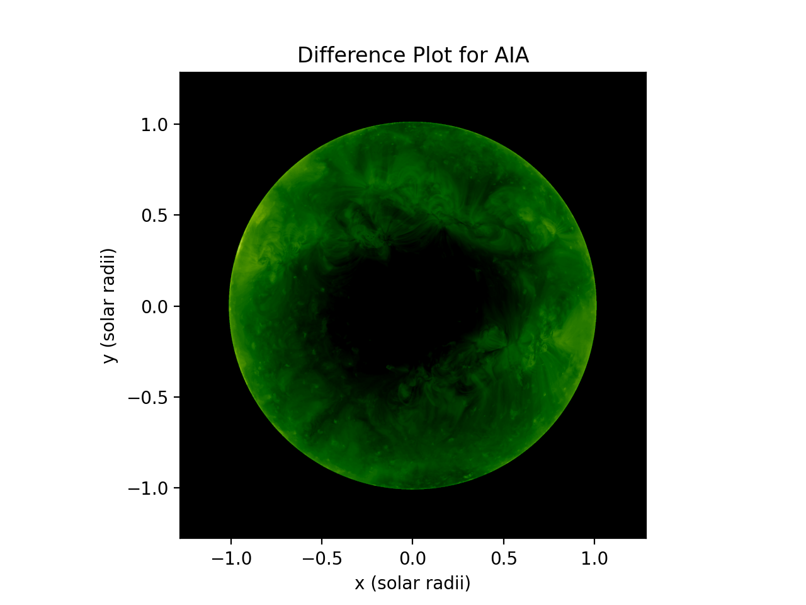
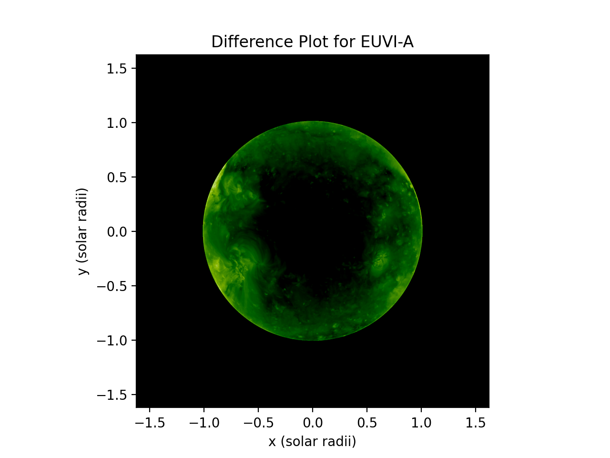
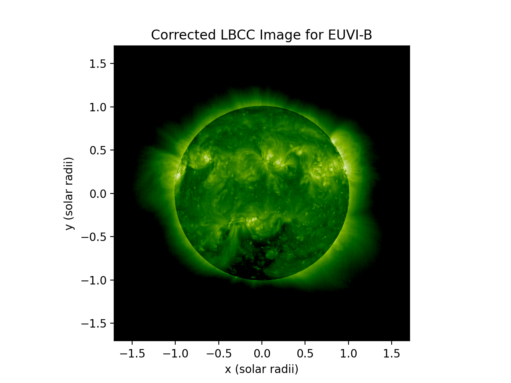
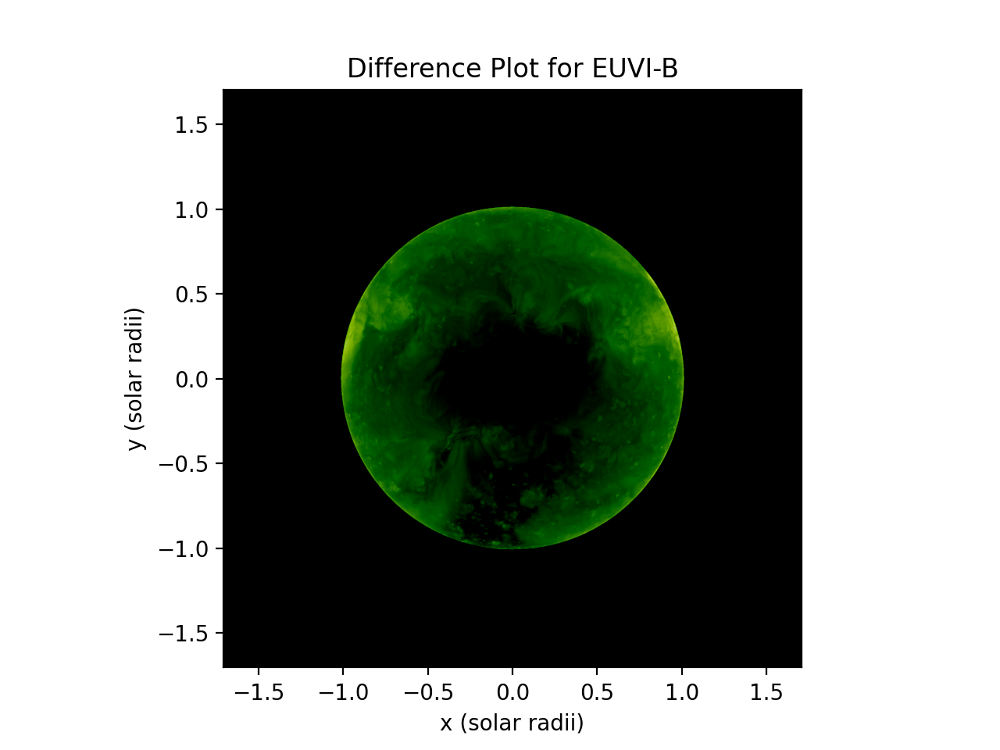

# Limb-Brightening Correction
Limb Brightening Correction (LBC) is the second step in the data pre-processing pipeline. 
The goal of LBC is to correct for brightening of structures that is 
dependent upon their distance from disk center.  

## Examples of Corrected Images
### AIA Images
[Original AIA Image](../img/lbc/AIA_original.png) | [Corrected AIA Image](../img/lbc/AIA_corrected.png) |  [Difference AIA Image](../img/lbc/AIA_difference.png)
- | - | -
 |  |    

### EUVI-A Images
[Original STA Image](../img/lbc/STA_original.png) | [Corrected STA Image](../img/lbc/STA_corrected.png) |  [Difference STA Image](../img/lbc/STA_difference.png)
- | - | -
 |   |   

### EUVI-B Images
[Original STB Image](../img/lbc/STB_original.png) | [Corrected STB Image](../img/lbc/STB_corrected.png) |  [Difference STB Image](../img/lbc/STB_difference.png)  
- | - | -
 |    |   

## Theoretical Analysis Pipeline

### Compute Histograms and Save to Database
This function computes 2D Histograms from processed images for use in the LBC process. It then saves these computed histograms to the database.  
The source code and example usage for this is found in the [CHD GitHub](https://github.com/predsci/CHD/blob/master/analysis/lbcc_analysis/LBCC_create_mu-hist.py) 
and the generalized function can be found [here](https://github.com/predsci/CHD/blob/master/analysis/lbcc_analysis/LBCC_theoretic_funcs.py).  

    def save_histograms(db_session, hdf_data_dir, inst_list, hist_query_time_min, hist_query_time_max, n_mu_bins=18,
                        n_intensity_bins=200, lat_band=[-np.pi / 64., np.pi / 64.], log10=True, R0=1.01):
        """
        function to create and save histograms to database
        """
        query_pd = db_funcs.query_euv_images(db_session=db_session, time_min=hist_query_time_min,
                                             time_max=hist_query_time_max, instrument=query_instrument)
        temp_hist = los_temp.mu_hist(image_intensity_bin_edges, mu_bin_edges, lat_band=lat_band, log10=log10)
        hist_lbcc = psi_d_types.create_lbcc_hist(hdf_path, row.image_id, method_id[1], mu_bin_edges,
                                                 image_intensity_bin_edges, lat_band, temp_hist)
        db_funcs.add_hist(db_session, hist_lbcc)
    
 
* 1.) <code>db_funcs.query_euv_images</code>  
    * queries database for images (from EUV_Images table) in specified date range  
* 2.) <code>los_temp.mu_hist</code>  
    * creates histogram based on number of mu and intensity bins    
* 3.) <code>psi_d_types.create_lbcc_hist</code>  
    * create histogram datatype from lbcc histogram  
* 4.) <code>db_funcs.add_hist</code>  
    * saves histograms to database (table Histogram) associating an image_id, meth_id, and basic information with histogram  

### Calculate and Save Theoretical Fit Parameters
This function queries histograms from the database then calculates LBC fit parameters which are then saved in the database.  
The source code and example usage for this is found in the [CHD GitHub](https://github.com/predsci/CHD/blob/master/analysis/lbcc_analysis/LBCC_beta-y_theoretical_analysis.py) 
and the generalized function can be found [here](https://github.com/predsci/CHD/blob/master/analysis/lbcc_analysis/LBCC_theoretic_funcs.py). 

    def calc_theoretic_fit(db_session, inst_list, calc_query_time_min, calc_query_time_max, weekday=0, number_of_days=180,
                       n_mu_bins=18, n_intensity_bins=200, lat_band=[-np.pi / 64., np.pi / 64.], create=False):
        """
        function to calculate and save (to database) theoretic LBC fit parameters
        """
        pd_hist = db_funcs.query_hist(db_session=db_session, meth_id=method_id[1], n_mu_bins=n_mu_bins,
                                          n_intensity_bins=n_intensity_bins,
                                          lat_band=np.array(lat_band).tobytes(),
                                          time_min=np.datetime64(min_date).astype(datetime.datetime),
                                          time_max=np.datetime64(max_date).astype(datetime.datetime),
                                          instrument=query_instrument)
        optim_out_theo = optim.minimize(lbcc.get_functional_sse, init_pars,
                                            args=(hist_ref, hist_mat, mu_vec, intensity_bin_array, model),
                                            method="BFGS")  
        db_funcs.store_lbcc_values(db_session, pd_hist, meth_name, meth_desc, var_name, var_desc, date_index,
                                       inst_index, optim_vals=optim_vals_theo[0:6], results=results_theo, create=True)                                                                   
                                          
* 1.) <code>db_funcs.query_hist</code>
    * queries database for histograms (from Histogram table) in specified date range
* 2.) <code>optim.minimize</code>
    * use theoretical optimization method to calculate fit parameters
* 3.) <code>db_funcs.store_lbcc_values</code>
    * save the six fit parameters to database using function [store_lbcc_values](https://github.com/predsci/CHD/blob/master/modules/DB_funs.py)
        * creates image combination combo_id of image_ids and dates in Images_Combos table
        * creates association between each image_id and combo_id in Image_Combo_Assoc table
        * creates new method “LBCC Theoretic” with an associated meth_id in Meth_Defs table
        * creates new variable definitions “TheoVar” + index with an associated var_id in Var_Defs table
        * store variable value as float in Var_Vals table with associated combo_id, meth_id, and var_id  
        
        

### Apply Limb-Brightening Correction and Plot Corrected Images
This function queries the database for LBC fit parameters then applies them to specified images, plotting resulting images before and after the correction.  
The source code and example usage for this is found in the [CHD GitHub](https://github.com/predsci/CHD/blob/master/analysis/lbcc_analysis/LBCC_apply_correction.py) 
and the generalized function can be found [here](https://github.com/predsci/CHD/blob/master/analysis/lbcc_analysis/LBCC_theoretic_funcs.py). 

    def apply_lbc_correction(db_session, hdf_data_dir, inst_list, lbc_query_time_min, lbc_query_time_max,
                         R0=1.01, plot=False):
        """
        function to apply limb-brightening correction and plot images within a certain time frame
        """ 
        image_pd = db_funcs.query_euv_images(db_session=db_session, time_min=lbc_query_time_min,
                                             time_max=lbc_query_time_max, instrument=query_instrument) 
        theoretic_query = db_funcs.query_var_val(db_session, meth_name, date_obs=original_los.info['date_string'],
                                                 instrument=instrument)
        beta1d, y1d, mu_indices, use_indices = lbcc.get_beta_y_theoretic_continuous_1d_indices(theoretic_query,
                                                                                               los_image=original_los)
        corrected_lbc_data[use_indices] = 10 ** (beta1d * np.log10(original_los.data[use_indices]) + y1d)
        if plot:
            Plotting.PlotImage(original_los, nfig=100 + inst_index, title="Original LOS Image for " + instrument)
            Plotting.PlotCorrectedImage(corrected_data=corrected_lbc_data, los_image=original_los, nfig=200 + inst_index,
                                   title="Corrected LBCC Image for " + instrument)
            Plotting.PlotCorrectedImage(corrected_data=original_los.data - corrected_lbc_data, los_image=original_los,
                                   nfig=300 + inst_index, title="Difference Plot for " + instrument)
                                                              
* 1.) <code>db_funcs.query_euv_images</code>
    * queries database for images (from EUV_Images table) in specified date range
* 2.) <code>db_funcs.query_var_val</code>
    * queries database for variable values associated with specific image (from Var_Vals table)
* 3.) <code>lbcc.get_beta_y_theoretic_continuous_1d_indices</code>
    * calculates 1d beta and y arrays for valid mu indices
        * uses variable values from query in step two
        * uses original los image to determine indices for correction
* 4.) <code>corrected_lbc_data[use_indices] = 10 ** (beta1d * np.log10(original_los.data[use_indices]) + y1d)</code>
    * applies correction to image based off beta, y, and original data arrays  
* 5.) <code>Plotting.PlotImage</code> and <code>Plotting.PlotCorrectedImage</code>
    * plots original and corrected images, and difference between them   
    

### Generate Plots of Beta and y 
This function queries the database for LBC fit parameters then generates plots of Beta and y over time.  
The source code and example usage for this is found in the [CHD GitHub](https://github.com/predsci/CHD/blob/master/analysis/lbcc_analysis/LBCC_generate_theoretic_plots.py) 
and the generalized function can be found [here](https://github.com/predsci/CHD/blob/master/analysis/lbcc_analysis/LBCC_theoretic_funcs.py).    

    def generate_theoretic_plots(db_session, inst_list, plot_query_time_min, plot_query_time_max, weekday, image_out_path,
                             year='2011', time_period='6 Month', plot_week=0, n_mu_bins=18):
        """
        function to generate plots of beta/y over time and beta/y v. mu
        """
        theoretic_query[date_index, :] = db_funcs.query_var_val(db_session, meth_name,
                         date_obs=np.datetime64(center_date).astype(datetime.datetime), instrument=instrument)
        plot_beta[mu_index, date_index], plot_y[mu_index, date_index] = lbcc.get_beta_y_theoretic_based(
                        theoretic_query[date_index, :], mu)
        beta_y_v_mu[index, :] = lbcc.get_beta_y_theoretic_based(theoretic_query[plot_week, :], mu)                                

* 1.) <code>db_funcs.query_var_val</code>
    * query fit parameters from database
* 2.) <code>lbcc.get_beta_y_theoretic_based(theoretic_query[date_index, :], mu)</code>
    * calculate beta and y correction coefficients over time using theoretic fit parameters and mu values
    * used for plotting beta and y over time
* 3.) <code>lbcc.get_beta_y_theoretic_based(theoretic_query[plot_week, :], mu)</code>
    * calculate beta and y correction coefficients for a specific week using theoretic fit parameters and mu values
    * used for plotting beta and y v. mu for a specific week

### Generate Histogram Plots
This function queries the database for histograms and LBC fit parameters then generates plots of histograms before and after the LBC correction.  
The source code and example usage for this is found in the [CHD GitHub](https://github.com/predsci/CHD/blob/master/analysis/lbcc_analysis/LBCC_generate_histogram_plots.py) 
and the generalized function can be found [here](https://github.com/predsci/CHD/blob/master/analysis/lbcc_analysis/LBCC_theoretic_funcs.py).    

        def generate_histogram_plots(db_session, hdf_data_dir, inst_list, hist_plot_query_time_min, hist_plot_query_time_max,
                             n_hist_plots=1, n_mu_bins=18, n_intensity_bins=200, lat_band=[-np.pi / 64., np.pi / 64.],
                             log10=True):
            """
            function to generate plots of histograms before and after limb-brightening
            """
            pd_hist = db_funcs.query_hist(db_session=db_session, meth_id=method_id[1], n_mu_bins=n_mu_bins,
                                      n_intensity_bins=n_intensity_bins, lat_band=np.array(lat_band).tobytes(),
                                      time_min=hist_plot_query_time_min, time_max=hist_plot_query_time_max, instrument=query_instrument)
            Plotting.Plot2d_Hist(plot_hist, date_obs, instrument, intensity_bin_edges, mu_bin_edges, figure,
                                 plot_index)
            original_los, lbcc_image, mu_indices, use_indices = iit_funcs.apply_lbc_correction(db_session, hdf_data_dir,
                                                                                                 instrument, row, n_intensity_bins, R0)
            hist_lbcc = psi_d_types.create_lbcc_hist(hdf_path, row.image_id, method_id[1], mu_bin_edges,
                                                         intensity_bin_edges, lat_band, temp_hist)
            Plotting.Plot_LBCC_Hists(plot_hist, date_obs, instrument, intensity_bin_edges, mu_bin_edges, figure,
                                     plot_index)
                                     
* 1.) <code>db_funcs.query_hist</code>
    * queries database for histograms (from Histogram table) in specified date range  
* 2.) <code>Plotting.Plot2d_Hist</code>  
    * plots 2D histogram with plot title and axes labels  
* 3.) <code>iit_funcs.apply_lbc_correction</code>  
    * applies Limb-Brightening Correction to images and creates LBCCImage datatype  
* 4.) <code>psi_d_types.create_lbcc_hist</code>  
    * create histogram datatype from lbcc histogram
* 5.) <code>Plotting.Plot_LBCC_Hists</code>  
    * plots original and LBC corrected 2D histograms  