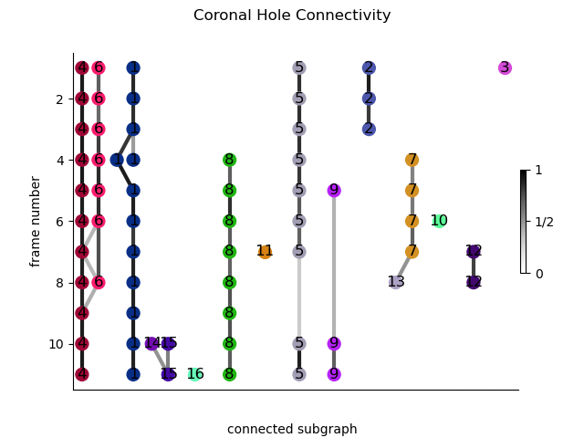

## Introduction to Graph Theory

A Graph G(V, E) is a data structure that is defined by a set of **Vertices** (or Nodes) (V) and and a set of **Edges** (E).
In an undirected graph G(V, E), two vertices u and v are called connected if G contains a path from u to v. 
Otherwise, they are called disconnected. If the two vertices are additionally connected by a path of length 1, 
i.e. by a single edge, the vertices are called adjacent. 

A graph is said to be **connected** if every pair of vertices in the graph is connected. 
This means that there is a path between every pair of vertices.
An undirected graph that is not connected is called disconnected. 
An undirected graph G is therefore disconnected if there exist two vertices in G such that no path in G has these vertices as endpoints. 

In our project, the coronal hole database will be a set of **connected weighted subgraphs**, 
where nodes are coronal hole contour object (see Contour.py) 
and edges connect identified coronal holes between two sequential frames (given area overlap results). The edge weight corresponds
to area overlap average ratio with previous frame instance (see [areaoverlap](areaoverlap.md)). 

## Implementation

In Python, there are several libraries available that provide Graph functionality. After some reading, 
it seems as *Networkx* is commonly used and is easy to use. In the module CoronalHoleGraph.py, 
there is a class called CoronalHoleGraph() . This class is the data structure that will store identified 
contours and their connectivity. For plotting purposes, each contour will be associated with a frame number (y-axis) 
and count (x-axis) in case of repetition in the same frame. Connectivity is determined by the area overlap of two contours. 

## Plotting Subgraphs 
In the plot below, the connected subgraphs are ordered hierarchically based on subgraph average node area. 
The edge color is based on the edge weight or area ratio, hence, dark edges correspond with strong 
overlap whereas light edges correspond to a weak overlap (see Grey colormap). 

!