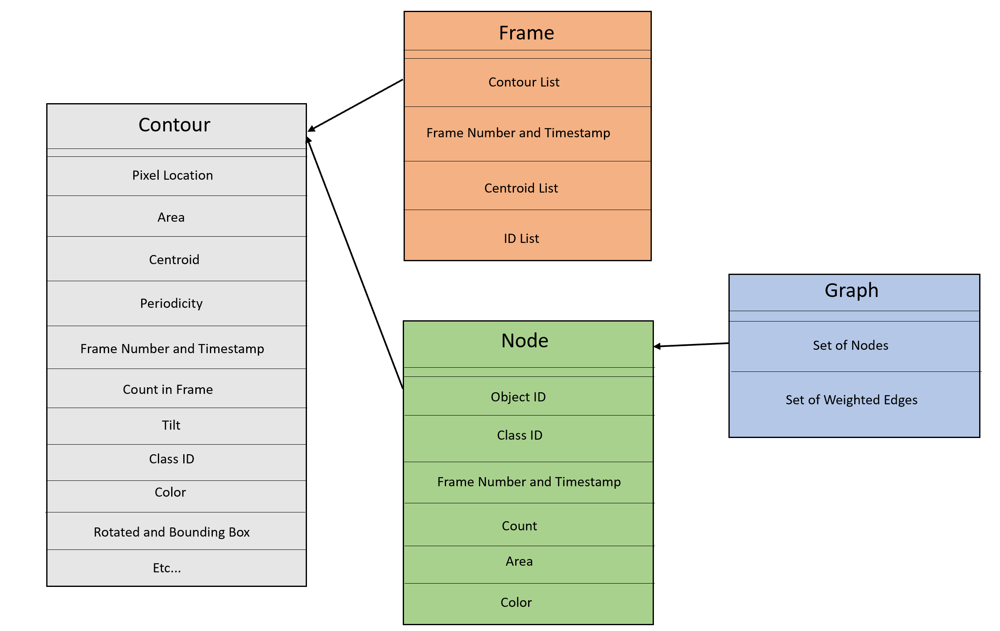
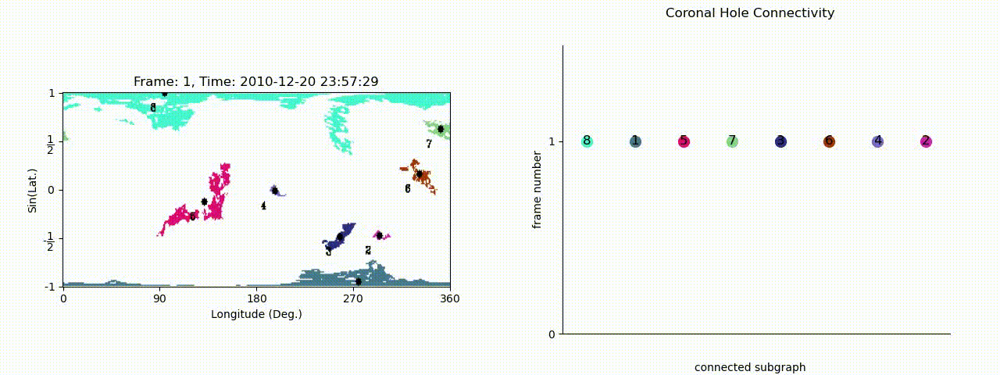

## Connectivity Graph

With the purpose of identifying coronal holes that split and merge, we implemented a connectivity graph, where each node is a coronal hole. The edges between nodes are established for two cases: 

(1) If there is an area overlap with the previous frame set of identified CHs that is greater than $\texttt{ConnectivityThresh}$.

(2) If the CH ID has appeared previously in the database, then we draw an edge with its most recent appearance.

Therefore, the connectivity graph is a set of connected directed weighted subgraphs, where edge weights corresponds to average ratio area overlap between two nodes. 

## Implementation

A Graph G(V, E) is a data structure that is defined by a set of **Vertices** (or Nodes) (V) and and a set of **Edges** (E). 
The coronal hole connectivity graph will be a set of **connected weighted subgraphs**, 
where nodes are CH contour objects and edges correspond the area overlap ratio (see [areaoverlap](areaoverlap.md)). 

## Plotting Subgraphs 
In the plot below, the connected subgraphs are ordered hierarchically based on the subgraph average node area. 
The edge color is based on the edge weight or area ratio, hence, dark edges correspond with strong 
overlap whereas light edges correspond to a weak overlap. 

