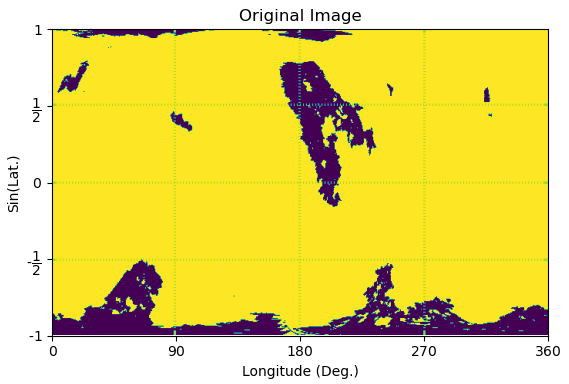
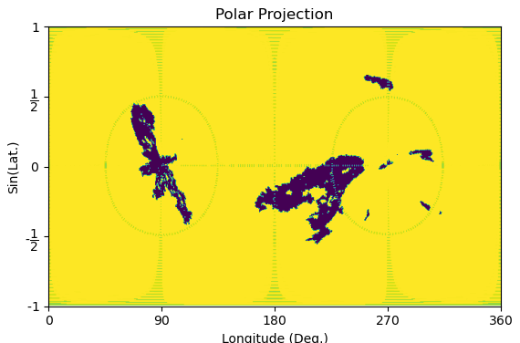

# Polar Projection 
The current images are in latitude - longitude coordinates with the poles placed at the top and bottom of the image.
In this current projection, clustering coronal holes at the poles is challenging due to the distortion near the poles.
In order to overcome this issue, we suggest a coordinate mapping placing the poles at the equator. 
This transformation can be done in *projection.py* module. 

{: style="height:250px;width:370px"}
{: style="height:250px;width:370px"}

## Mapping Transformation
Input: image dimensions $(n_{\theta}, n_{\phi})$, where $\theta \in [0, \pi]$ and $\phi \in [0, 2\pi]$.

- ** *Step 1* **: Convert to Cartesian coordinates ($x,y,z$).

      $x = \rho \sin(\theta)\cos(\phi)$,
      
      $y = \rho \sin(\theta)\sin(\phi)$,
      
      $z = \rho \cos(\theta)$,
      
      where $\rho = 1$. 
  
- ** *Step 2* **: Rotate about the x axis with $\alpha = \pi/2$.

- ** *Step 3* **: Map back to spherical coordinates ($\theta$, $\phi$).

      $\theta = \arccos(\frac{z}{\rho}) = \arccos(\sin(\theta)\sin(\phi))$,
      
      $\phi = \arctan(\frac{y}{x}) = \arctan(\frac{-\cos(\theta)}{\sin(\theta)\cos(\phi)})$.
