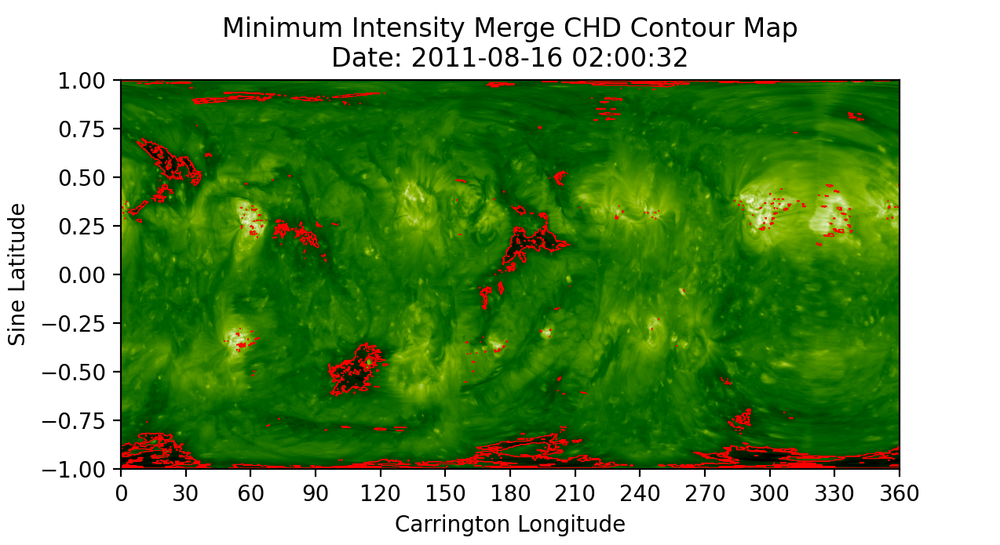

# Supervised Detection: Convolutional Neural Network

Supervised machine learning maps an input to an output based on example input-output pairs. 
It requires labeled data in order to train the model and predict outputs accurately. The advantage
of supervised machine learning is its ability to deal with large datasets. Supervised learning does
require additional up front work to create the labeled dataset however once trained can be applied
to vast datasets to produce results.  

In order to train your model, supervised learning requires three datasets: training data, validation data,
and test data. The training data is what the model is actually trained on while validation data is used
to ensure that the training and model is working properly. The validation data additionally provides an unbiased
dataset for evaluation of our model We look at both validation and training loss when training our model. Finally we have
our test dataset. This is data the model has never seen before and is used to ensure that our model works
properly and achieves the results we want.  

The code for training the supervised learning CNN model is found [here](https://github.com/predsci/CHD/blob/master/chmap/coronal_holes/ml_detect/src/unet_supervised.py).  
The code for building maps using the supervised learning model is found [here](https://github.com/predsci/CHD/blob/master/chmap/coronal_holes/ml_detect/examples/supervised_mapping_pipeline.py).   
The functions used for building this model are found [here](https://github.com/predsci/CHD/blob/master/chmap/coronal_holes/ml_detect/tools/ml_functions.py).  
Additionally there is a previously trained model that can be used and is stored in our github [here](https://github.com/predsci/CHD/blob/master/chmap/coronal_holes/ml_detect/tools/model_unet.h5), and
this is what is used in the mapping pipeline and examples shown below.  

## CNN - Supervised Learning to Detect Coronal Holes

The convolutional neural network is a deep learning neural network that can be used to solve a variety
of problems. In this case we are using this neural network model for image segmentation. It is specifically
designed to look at pixel data to recognize features.  

The main steps of building this model are:  
 
* dataset creation  
    * converting data to tensors  
    * building training, validation, and test datasets  
* building the U-Net model  
    * includes encoder and decoder pathways  
    * uses tensorflow keras functions  
* training the model  
    * required large amounts of data  
* validation of model  
    * use training loss curve  
    * look at predictions on test data  
    
You can find a full writeup [here](https://tamarervin.medium.com/convolutional-neural-network-for-coronal-hole-detection-eceaeb73474e).  
    
####[U-Net Outline](images/unet_diagram.png)

####[Training Loss](images/train_val_loss.png)

### Example Images

####[Test Data](images/pred_test.png)

####[Supervised Detection Map](images/supervised_chd.png)
