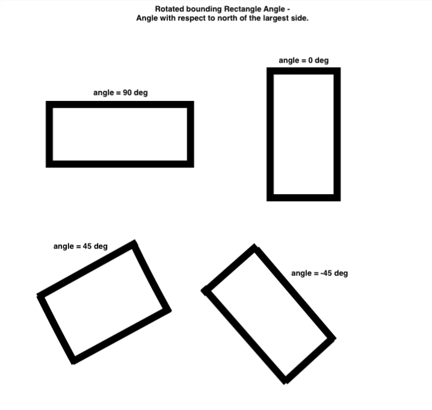

## Centroid 
Computed in cartesian coordinates and then map back to spherical (weighted average with respect to mesh grid).

## Area
The sum of all pixels area contained in coronal hole. 

## Straight bounding box
Bounding rectangle perpendicular to image axis. This feature can measure how the object spreads over time.

1. straight bounding box corners

2. straight bounding box area

## Rotated bounding box
Rectangle with minimum pixel area that contains the coronal hole. This can tell us the approximate tilt of 
the coronal hole and its convexity.

1. rotated bounding box corners

2. rotated bounding box area

3. rotated bounding box angle - angle with respect to north and largest side. 

{ width=50% height=50%}
    
## Convex Hull
Measure the convexity of the coronal hole by comparing of the convex hull vs the coronal hole area.
* Do we want this?

## Tilt
* Do I compute the angle between each pixel with respect to north? Then weighted average?
TODO... 
